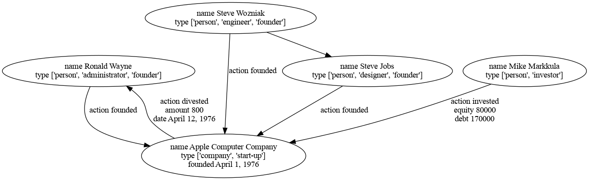
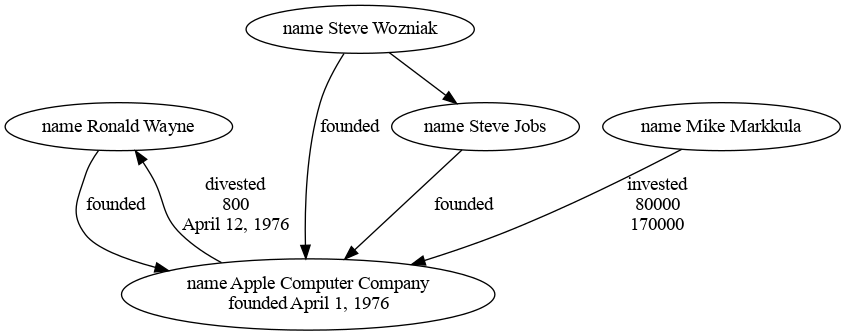

# About

This is the [Python](https://www.python.org/) implementation, now [available in PyPI](https://pypi.org/project/simple-graph-sqlite/).

# Usage

## Installation Prerequisites

* [SQLite](https://www.sqlite.org/), version 3.31.0 or higher; get the latest source or precompiled binaries from the [SQLite Download Page](https://www.sqlite.org/download.html) 
* [Python](https://www.python.org/)
* [Graphviz](https://graphviz.org/) for visualization ([download page](https://www.graphviz.org/download/), [installation procedure for Windows](https://forum.graphviz.org/t/new-simplified-installation-procedure-on-windows/224))

Install from [latest PyPI](https://pypi.org/project/simple-graph-sqlite/):

* `pip install simple-graph-sqlite`

or using this source distribution:

* `pip install -r requirements.txt`

## Basic Functions

The [database script](database.py) provides convenience functions for [atomic transactions](https://en.wikipedia.org/wiki/Atomicity_(database_systems)) to add, delete, connect, and search for nodes.

Any single node or path of nodes can also be depicted graphically by using the `visualize` function within the database script to generate [dot](https://graphviz.org/doc/info/lang.html) files, which in turn can be converted to images with Graphviz. 

## Testing

There are unit tests for both the [core functions](database_test.py) and [visualizers](visualizers_test.py) in [pytest](https://docs.pytest.org/en/latest/) covering each of the basic functions.

If you have the correct version of SQLite installed, everything should just work without errors:

```sh
$ pytest
================================ test session starts ================================
platform linux -- Python 3.9.15, pytest-7.2.0, pluggy-1.0.0
rootdir: /home/denis/repos/repos-git/simple-graph/python
collected 8 items                                                                   

database_test.py ......                                                       [ 75%]
visualizers_test.py ..                                                        [100%]

================================= 8 passed in 1.09s =================================
```

### Example

Dropping into a python shell, we can create, [upsert](https://en.wiktionary.org/wiki/upsert), and connect people from the early days of [Apple Computer](https://en.wikipedia.org/wiki/Apple_Inc.). The resulting database will be saved to a SQLite file named `apple.sqlite`:

```
>>> apple = "apple.sqlite"
>>> import database as db                          # if using this source distribution; or
>>> from simple_graph_sqlite import database as db # if installed from PyPI
>>> db.initialize(apple)
>>> db.atomic(apple, db.add_node({'name': 'Apple Computer Company', 'type':['company', 'start-up'], 'founded': 'April 1, 1976'}, 1))
>>> db.atomic(apple, db.add_node({'name': 'Steve Wozniak', 'type':['person','engineer','founder']}, 2))
>>> db.atomic(apple, db.add_node({'name': 'Steve Jobs', 'type':['person','designer','founder']}, 3))
>>> db.atomic(apple, db.add_node({'name': 'Ronald Wayne', 'type':['person','administrator','founder']}, 4))
>>> db.atomic(apple, db.add_node({'name': 'Mike Markkula', 'type':['person','investor']}, 5))
>>> db.atomic(apple, db.connect_nodes(2, 1, {'action': 'founded'}))
>>> db.atomic(apple, db.connect_nodes(3, 1, {'action': 'founded'}))
>>> db.atomic(apple, db.connect_nodes(4, 1, {'action': 'founded'}))
>>> db.atomic(apple, db.connect_nodes(5, 1, {'action': 'invested', 'equity': 80000, 'debt': 170000}))
>>> db.atomic(apple, db.connect_nodes(1, 4, {'action': 'divested', 'amount': 800, 'date': 'April 12, 1976'}))
>>> db.atomic(apple, db.connect_nodes(2, 3))
>>> db.atomic(apple, db.upsert_node(2, {'nickname': 'Woz'}))
```

There are also bulk operations, to insert and connect lists of nodes in one transaction.

The nodes can be searched by their ids:

```
>>> db.atomic(apple, db.find_node(1))
{'name': 'Apple Computer Company', 'type': ['company', 'start-up'], 'founded': 'April 1, 1976', 'id': 1}
```

Searches can also use combinations of other attributes, both as strict equality, or using `LIKE` in combination with a trailing `%` for "starts with" or `%` at both ends for "contains":

```
>>> db.atomic(apple, db.find_nodes([db._generate_clause('name', predicate='LIKE')], ('Steve%',)))
[{'name': 'Steve Wozniak', 'type': ['person', 'engineer', 'founder'], 'id': 2, 'nickname': 'Woz'}, {'name': 'Steve Jobs', 'type': ['person', 'designer', 'founder'], 'id': 3}]
>>> db.atomic(apple, db.find_nodes([db._generate_clause('name', predicate='LIKE'), db._generate_clause('name', predicate='LIKE', joiner='OR')], ('%Woz%', '%Markkula',)))
[{'name': 'Steve Wozniak', 'type': ['person', 'engineer', 'founder'], 'id': 2, 'nickname': 'Woz'}, {'name': 'Mike Markkula', 'type': ['person', 'investor'], 'id': 5}]
```

More complex queries to introspect the json body, using the [sqlite json_tree() function](https://www.sqlite.org/json1.html), are also possible, such as this query for every node whose `type` array contains the value `founder`:

```
>>> db.atomic(apple, db.find_nodes([db._generate_clause('type', tree=True)], ('founder',), tree_query=True, key='type'))
[{'name': 'Steve Wozniak', 'type': ['person', 'engineer', 'founder'], 'id': 2, 'nickname': 'Woz'}, {'name': 'Steve Jobs', 'type': ['person', 'designer', 'founder'], 'id': 3}, {'name': 'Ronald Wayne', 'type': ['person', 'administrator', 'founder'], 'id': 4}]
```

See the `_generate_clause()` and `_generate_query()` functions in [database.py](database.py) for usage hints.

Paths through the graph can be discovered with a starting node id, and an optional ending id; the default neighbor expansion is nodes connected nodes in either direction, but that can changed by specifying either `find_outbound_neighbors` or `find_inbound_neighbors` instead:

```
>>> db.traverse(apple, 2, 3)
['2', '1', '3']
>>> db.traverse(apple, 4, 5)
['4', '1', '2', '3', '5']
>>> db.traverse(apple, 5, neighbors_fn=db.find_inbound_neighbors)
['5']
>>> db.traverse(apple, 5, neighbors_fn=db.find_outbound_neighbors)
['5', '1', '4']
>>> db.traverse(apple, 5, neighbors_fn=db.find_neighbors)
['5', '1', '2', '3', '4']
```

Any path or list of nodes can rendered graphically by using the `visualize` function. This command produces [dot](https://graphviz.org/doc/info/lang.html) files, which are also rendered as images with Graphviz:

```
>>> from visualizers import graphviz_visualize
>>> graphviz_visualize(apple, 'apple.dot', [4, 1, 5])
```

The [resulting text file](../.examples/apple-raw.dot) also comes with an associated image (the default is [png](https://en.wikipedia.org/wiki/Portable_Network_Graphics), but that can be changed by supplying a different value to the `format` parameter)

The default options include every key/value pair (excluding the id) in the node and edge objects:



There are display options to help refine what is produced:

```
>>> graphviz_visualize(apple, 'apple.dot', [4, 1, 5], exclude_node_keys=['type'], hide_edge_key=True)
```



The [resulting dot file](../.examples/apple.dot) can be edited further as needed; the [dot guide](https://graphviz.org/pdf/dotguide.pdf) has more options and examples.